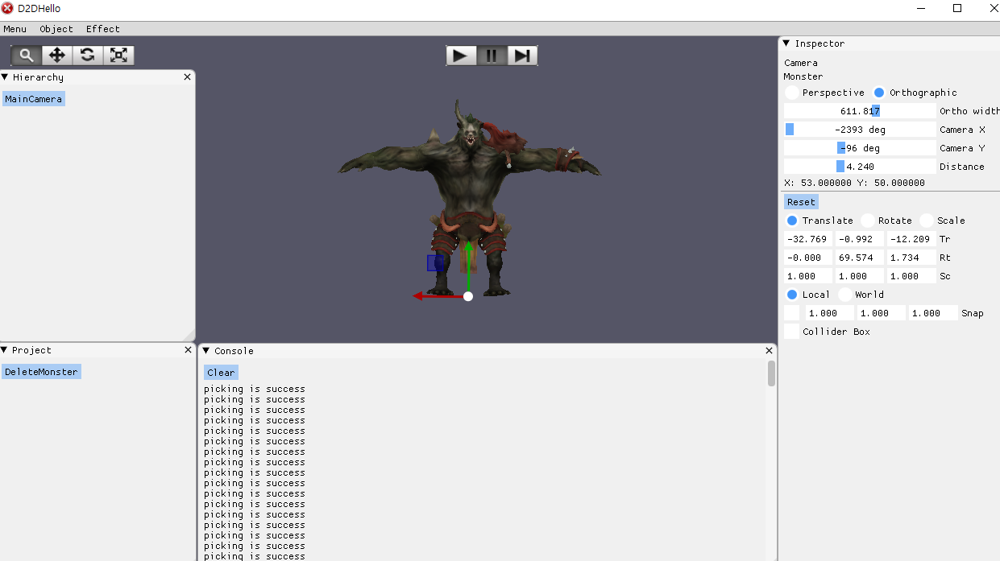

# portfolio_DirectX11
<h5>게임엔진 Unity와 기능을 따라 한 포트폴리오입니다.</h5>
<ul>
<h2>기능설명</h2>
<li>WindowAPI 와 Direct X 11(라이브러리) 그리고 gui 기능은 Imgui(라이브러리)를 사용하였습니다.</li>
<li>3D 오브젝트를 파일로 fbx 파일로 읽은 후 크기를 자유자재로 움직일 수 있습니다.</li>
<li>키보드 이벤트는 싱글톤 디자인 패턴을 사용하였습니다. </li>
</ul>
  
<h2><a href="https://www.youtube.com/watch?v=ZVq0V6tJQ4I">포트폴리오 시연 영상</a> </h2>
